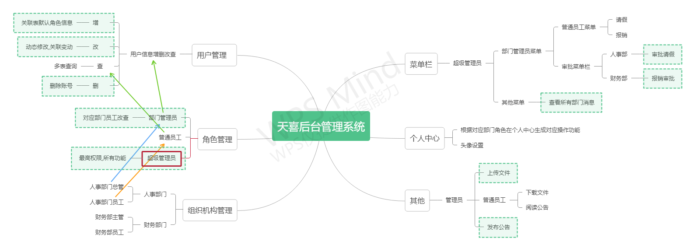
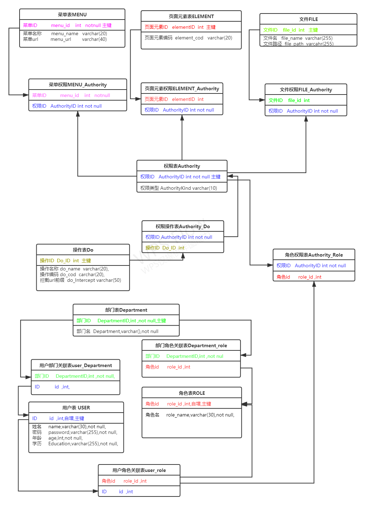

# 工程简介
本系统基于shiro安全框架建立员工后台权限管理系统 
目的是实现不同部门不同职级不同员工在登录管理系统后根据个人账号等级权限,有不同的菜单栏功能,从而实现权限分配管理

#技术栈简介
- 核心框架：Spring Boot 2.3.7.RELEASE
- 安全框架：Apache Shiro 1.7.1
- 视图框架：Spring MVC 
- 持久层框架：MyBatis Plus 3.4.3.4
- 日志管理：SLF4J 1.7、Log4j
- 页面交互：Vue2.x

##软件需求
- JDK1.8
- MySQL5.5+
- Maven3.0+

# 项目初期功能实现图
> 

#项目初期数据库结构关系
> 

